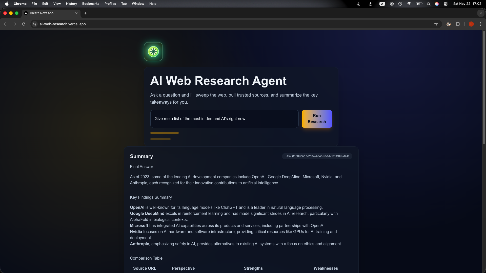
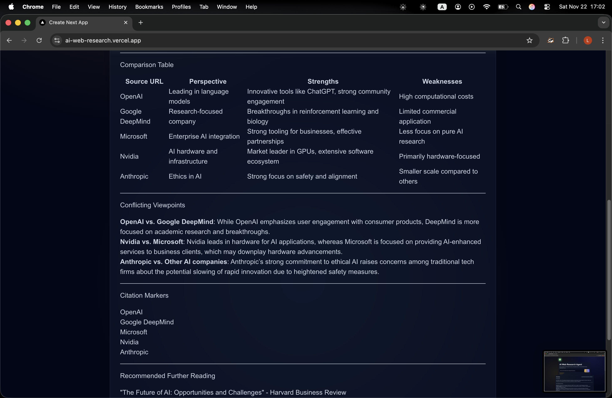
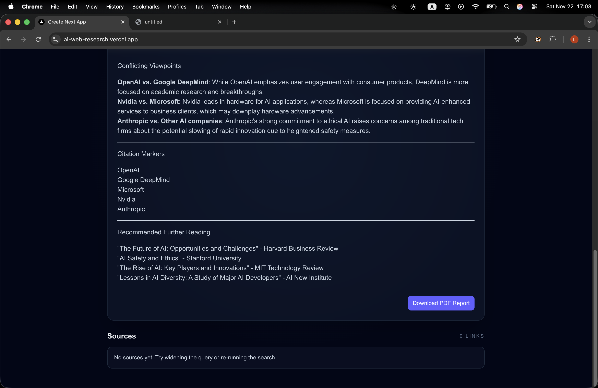
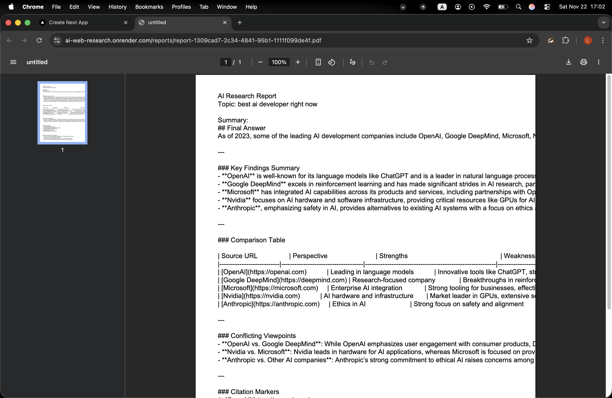

## 🚀 AI Web Research Agent

A fully automated AI-powered research engine that searches the web, crawls webpages with a real browser, extracts article content, evaluates reliability, generates screenshots, and produces structured AI summaries with PDF export.

Live Demo: https://ai-web-research.vercel.app
Landing Page: https://ai-web-research.vercel.app/landing
GitHub: https://github.com/lemonbanan4/ai-web-research

## 🔍 Overview

The AI Web Research Agent performs multi-stage automated research:

Queries DuckDuckGo for real search results

Launches Playwright Chromium to crawl webpages

Extracts readable content using Mozilla Readability.js

Captures full-page screenshots

Scores sources with a custom credibility algorithm

Summarizes findings using OpenAI

Generates a clean PDF report

Built with Next.js, FastAPI, Playwright, Docker, and OpenAI, deployed on Vercel + Render.

## ✨ Features
🔎 Web Search

Powered by DuckDuckGo Instant API.

🌐 Browser Automation

Playwright crawls real webpages and handles dynamic content.

🧹 Article Extraction

Readability.js strips ads and extracts clean text.

🤖 AI Summary

Structured summaries using OpenAI.

📊 Source Reliability

Custom scoring for credibility.

🖼 Screenshots

Automatic full-page captures for each source.

📄 PDF Export

Professional research report generated with ReportLab.

🖼 Screenshots
Main App

  

Summary View

  

Source Cards

  

PDF Export

  

## 🧱 Architecture
┌──────────────────┐     ┌────────────────────┐     ┌────────────────────────┐
│     Frontend     │     │      Backend       │     │      Playwright        │
│ Next.js (Vercel) │◄───►│ FastAPI (Render)   │◄───►│   Chromium Browser     │
└──────────────────┘     └────────────────────┘     └────────────────────────┘
         │                         │                            │
         ▼                         ▼                            ▼
 User enters query        /research (task)            Visits URLs, extracts text
         │                         │                            │
         ▼                         ▼                            ▼
 Poll /research/id         Search DDG                 Clean text via Readability
         │                         │                            │
         ▼                         ▼                            ▼
  Live progress          Summarize with OpenAI          Capture screenshots
         │                         │                            │
         └──────────────► Structured output ◄───────────────────┘

## 🛠 Tech Stack
Frontend

Next.js 14

React

TailwindCSS

React Markdown

Deployed on Vercel

Backend

FastAPI

Playwright (Chromium)

Readability.js

DuckDuckGo Search

OpenAI

ReportLab

Deployed on Render (Docker)

DevOps

Docker

Persistent Render Disk

Environment Secrets

## 🧪 Local Setup
Backend

cd ai-web-research-backend
python3 -m venv venv
source venv/bin/activate
pip install -r requirements.txt
playwright install chromium
uvicorn main:app --reload --port 8000

Frontend
cd ai-web-research-frontend
npm install
npm run dev

.env.local
NEXT_PUBLIC_API_URL=http://localhost:8000

## DEPLOY
VERCEL

RENDER

## 🚀 Roadmap
Google Search support
Inline Perplexity-style citations
Multi-turn conversational research
Light mode toggle
Proxy rotation for hard websites
Enriched extraction from paywalled sites
Embeddings + vector search

## 👤 Author

Lemonbanan4
Building full-stack AI projects from scratch.

GitHub → https://github.com/lemonbanan4
Live Demo → https://ai-web-research.vercel.app
Landing Page → https://ai-web-research.vercel.app/landing
